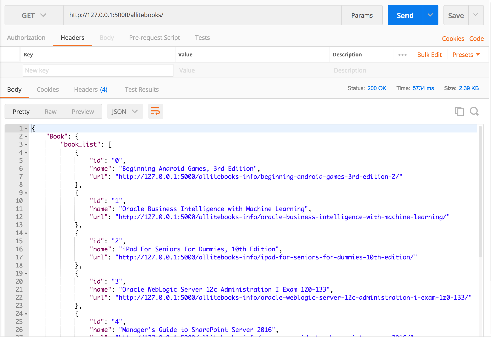

## toapi-ebooks

### What is toapi-ebooks?

This project uses [Toapi](https://github.com/gaojiuli/toapi) to build a friendly and robust API from some websites such as allitebooks, digilibraries, etc


``` shell

# or git clone https://github.com/toapi/toapi-ebooks
toapi new toapi/toapi-ebooks
cd toapi-ebooks

```

Please start Redis before running this script: `python wsgi.py`

Then, everything is done, the following content will show on screen:


### Usage:

Once the server is started, you can get JSON data from toapi-ebooks, visit `http://127.0.0.1:5000/allitebooks/`



### Deploy:

We recommend that you use Caddy(Nginx) + Gunicorn
